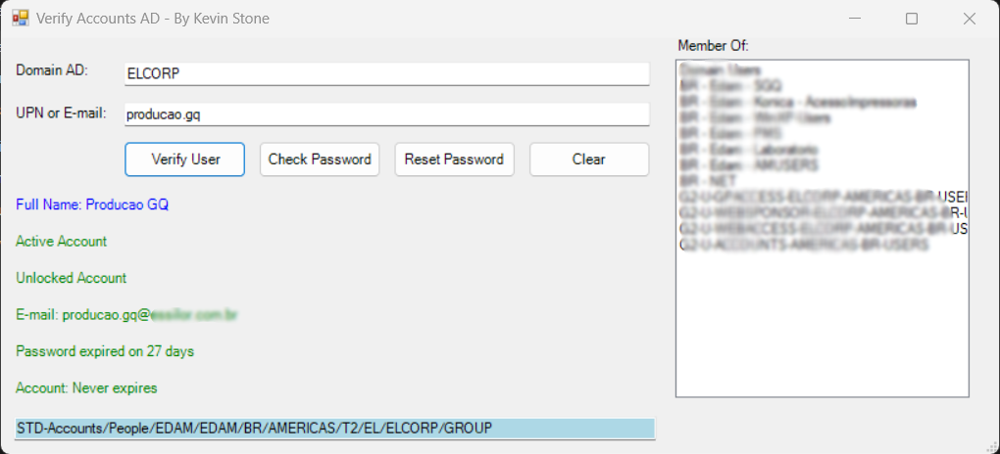

# 🛠️ Tool - Querying Users in Active Directory

Ferramenta desenvolvida em **PowerShell com interface gráfica (Windows Forms)** para facilitar a consulta e gerenciamento de usuários no **Active Directory**.


---

## ✨ Funcionalidades

- 🔍 **Verificar usuário**: Consulta se o UPN ou e-mail existe no AD.
- 🔑 **Validar senha**: Verifica se a senha informada é válida.
- 🔁 **Redefinir senha**: Permite redefinir senhas expiradas ou conhecidas.
- 🧹 **Limpar campos**: Limpa os campos preenchidos, exceto o domínio.

---

## 📦 Requisitos

- Windows 10 ou superior
- PowerShell 5.1+
- Permissões para consultar o AD

---

## 🚀 Como usar

1. Clone o repositório:
   ```bash
   git clone https://github.com/KevinStoneTech/Tool-Querying-Users-Active-Directory.git
   ```

2. Execute o script principal:
   ```powershell
   .\VerifyAccounts.ps1
   ```
   ```exe
   Ou executa o VerifyAccounts.exe
   ```
   

3. Preencha os campos e utilize os botões conforme necessário.

---

## 🖼️ Imagem de funcionamento



---

## 📌 Observações

- A ferramenta utiliza `System.DirectoryServices.AccountManagement` para interagir com o AD.
- Os tooltips explicam a função de cada botão ao passar o mouse.

---

## 📄 Licença

Este projeto está sob a licença MIT. Veja o arquivo [LICENSE](LICENSE) para mais detalhes.
